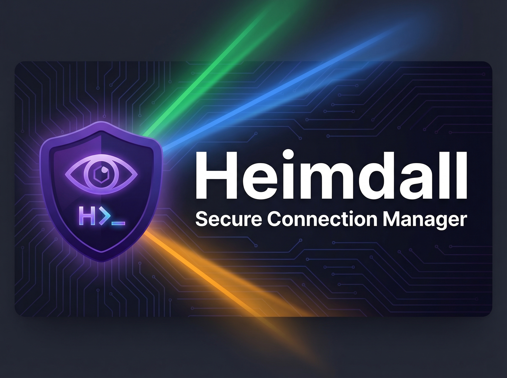

<!--
  Copyright 2026 Julien Bombled

  Licensed under the Apache License, Version 2.0 (the "License");
  you may not use this file except in compliance with the License.
  You may obtain a copy of the License at

      http://www.apache.org/licenses/LICENSE-2.0
-->



# Heimdall.Next

[](https://github.com/VBlackJack/Heimdall.Next/actions/workflows/ci.yml)
[](LICENSE)
[]()
[]()

**The secure, all-in-one Windows connection manager for RDP, SSH, SFTP, VNC, Telnet, FTP, Citrix, and local terminals.**

Built with .NET 10 and WPF. Secure, feature-rich Windows connection manager with enterprise-grade encryption and modern UX.

---

## Why Heimdall.Next?

- **8 protocols, one interface** --- RDP, SSH, SFTP, VNC, Telnet, FTP, Citrix, and local shell sessions in a single tabbed window
- **Zero-trust credential storage** --- DPAPI encryption + HMAC-SHA256 integrity, PBKDF2 PIN protection, Windows ACL enforcement
- **External vault integration** --- KeePassXC, Bitwarden CLI, 1Password CLI, or any command-line password manager
- **Pageant-native** --- Direct IPC with PuTTY Pageant via shared memory (no agent forwarding hacks)
- **Portable** --- Self-contained build with no installer required

---

## Features

### Remote Desktop (RDP)
- Embedded sessions via ActiveX MsTscAx in a tabbed interface
- External sessions via mstsc.exe with credential autofill
- Dynamic resolution resize with stabilization guard
- Aspect ratio management (Stretch, 16:9, 4:3, 21:9) and anti-idle prevention
- Full redirection surface: clipboard, drives, printers, COM ports, smart cards, webcam, USB, audio
- Credential autofill for CredUI dialogs (EnumThreadWindows + UI Automation)

### SSH Terminal
- Embedded terminal via WebView2 + xterm.js (full VT100/xterm rendering)
- Pipe mode transport for correct arrow keys, colors, and escape sequences
- Pageant agent integration (native Win32 IPC with identity count verification)
- SSH keepalive heartbeat (prevents TMOUT disconnects)
- TOFU host key verification with persistent fingerprint store
- Multi-gateway tunnel chaining with circular dependency detection
- Dynamic tunnel port allocation (no more port conflicts)
- Tunnel ref-counting (shared tunnels survive individual session close)
- Terminal resize via SSH window-change request
- X11 forwarding with automatic X server detection and auto-start
- 25 structured failure codes with localized error messages
- Auto-reconnect overlay on unexpected disconnect (SSH and RDP)

### VNC
- Embedded VNC viewer via noVNC + WebView2
- WebSocket-to-TCP proxy for seamless integration
- Clipboard sync, scaling modes, view-only mode
- WebView2 portable deployment (bundled Fixed Version Runtime for isolated servers)

### Telnet
- Raw TCP Telnet with IAC negotiation
- NAWS (window size) subnegotiation support
- Rendered in the same xterm.js terminal as SSH
- Username/password authentication, plaintext security warning

### SFTP Browser
- Embedded file browser panel with directory tree and file list
- Dual edit modes: integrated AvalonEdit editor OR external editor with auto-upload on save
- **"Browse as root" sudo mode**: toggle in toolbar enables `sudo ls -la` directory listing via SSH exec channel — browse any directory regardless of SFTP user permissions
- **Full sudo fallback** on all operations: upload (`sudo tee`), download (`sudo cat`), edit, chmod, rename, delete, mkdir — transparently triggered on permission denied
- Drag-and-drop upload and download
- Chmod dialog, path bookmarks, filename filter

### FTP Browser
- FTP client using built-in .NET (no external dependencies)
- Reuses the full SFTP browser UI via `IRemoteBrowser` interface
- Configurable passive mode and SSL/TLS (FTPS) support
- Unix and DOS directory listing format support

### Citrix
- StoreBrowse integration for published applications and desktops
- SSO (Kerberos) authentication support
- Embedded session tabs with the same UX as RDP

### Multi-Exec Broadcast
- Send keystrokes simultaneously to multiple active SSH sessions
- Visual indicators: colored border and BROADCAST badge on receiving terminals

### Quick Connect (Ctrl+K)
- Command palette for ad-hoc connections without saving a server profile
- Supports `user@host:port` format with optional protocol prefix
- Bare IP or hostname input auto-proposes SSH and RDP connections
- Also used as split session server picker (fuzzy search scales to any inventory size)
- Recent connection history for quick re-use

### Tunnel Panel
- Retractable side panel showing all active SSH tunnels
- Real-time status, local port, remote target, and gateway chain display
- Tunnel chain visualization in session tab headers (via GatewayA -> GatewayB)
- Dynamic port allocation with ref-counting for shared tunnels

### Server Health Monitoring
- Collapsible sidebar panel showing CPU, RAM, and Disk usage
- Multiplexed SSH channel (doesn't interfere with the terminal session)
- Polls `top`, `free`, `df` every 5 seconds with progress bars

### Macro Recorder
- Record terminal input with timing between keystrokes
- Save macros to JSON files, replay with original delays
- Accessible from session context menu

### Network Scanner
- ICMP ping sweep on CIDR subnets (Ctrl+Shift+N)
- TCP port probe on responsive hosts (SSH, RDP, VNC, HTTP, HTTPS)
- One-click "Add to Servers" for discovered hosts with auto-detected connection type

### Scheduled Tasks
- Daily or interval-based automatic connection scheduler
- Background timer with proper async dispatch and semaphore-guarded ticks

### External Tools
- Configurable tools in server context menu with inline edit panel
- 8 variable placeholders: `{Host}`, `{Port}`, `{User}`, `{ServerName}`, `{Protocol}`, `{KeyFile}`, `{Project}`, `{Gateway}`
- Run as Administrator, Run Hidden, Working Directory options
- File browser for executable selection
- Integrated into Ctrl+K command palette

### Quick File Server
- One-click HTTP + TFTP server for transferring files to servers without SFTP (hardened servers, containers, network equipment)
- Displays ready-to-use `wget`/`curl`/`tftp` commands, auto-copies URL to clipboard
- HTTP: directory listing, MIME types, path traversal protection
- TFTP: RFC 1350 read-only implementation

### Built-in Sysops Toolbox (31 tools)

All tools open as session tabs (split, detach, reorder). Accessible via **Ctrl+K** palette, **Ctrl+Shift+T** sidebar panel, or **"+" → Add Tool** menu. Tools can be saved in the TreeView alongside servers. Centralized `ToolRegistry` with icons, categories, and command aliases. Recent tools shown in palette on open. Singleton behavior for context-free tools.

| Category | Tools |
|----------|-------|
| **Network** | Ping Monitor, DNS Lookup (custom server), SSL Cert Inspector (chain + TLS version), Port Scanner (progress + banner grab), Subnet Calculator (IPv4 + IPv6), IP Converter, HTTP Status Codes, Whois Lookup, Network Calculator (supernet + VLAN planner) |
| **Security** | Password Generator (crack time + history), SSH Key Generator (RSA + Ed25519), Hash Generator (SHA3 + progress), HMAC Generator, JWT Parser (HMAC signature verify), Certificate Generator (self-signed + CA/leaf), TOTP Generator (RFC 6238) |
| **Encoding** | Base64 Encoder (URL-safe RFC 4648), URL Encoder, JSON Formatter (error position), Regex Tester (match highlighting), Text Diff (word-level), Text Case Converter (8 formats) |
| **System** | Chmod Calculator, Crontab Builder, DateTime Converter (timezone + relative), UUID Generator (v4 + v7), Hosts File Editor, SSH Config Generator, Log Viewer / Tail (regex filter), Cron Job Manager (crontab + Windows tasks), Service Status Dashboard |

### Session Management
- Tabbed sessions with drag-to-reorder
- Tab detach to floating window (Chrome-style drag-out or context menu)
- Split pane with full metadata preservation across split/unsplit
- Session transcript logging with ANSI code stripping
- Connection history log (JSONL with auto-rotation)
- Screenshot capture to clipboard (Ctrl+Shift+S)

### User Interface
- Runtime Dark and Light theme switching (1,700+ lines of WPF control styles)
- 5 terminal color schemes: Dracula, Solarized Dark, Monokai, Nord, Default
- Configurable terminal font family and size
- Settings panel with 6 left-navigation sub-tabs (General, Terminal, SSH & SFTP, RDP, Security, Advanced)
- Server Dialog: protocol-aware tabs (credentials on Authentication, options per protocol, hidden tabs for irrelevant sections)
- TreeView hierarchy: Project > Group > Server with merged status dots
- Connection inheritance: group-level defaults for gateway, SSH username, key path
- Empty state with welcome panel and import call-to-action
- Fullscreen mode (F11), toggle sidebar (Ctrl+B), filter (Ctrl+F)
- Bilingual interface: English and French (~2,889 i18n keys)
- WCAG 2.1 AA accessibility: AutomationProperties on all interactive controls, keyboard focus indicators, TextTrimming on dynamic content

### Security
- DPAPI encryption + HMAC-SHA256 integrity via unified `CredentialProtector`
- External credential provider: KeePassXC CLI, Bitwarden CLI, 1Password CLI, or any CLI tool
- PBKDF2-SHA256 PIN hashing (100,000 iterations) with lockout mechanics
- Windows ACL enforcement on config directories, log files, and temp files
- Input validation and sanitization against injection patterns (CWE-78) on all process arguments and placeholder expansion
- HTTP/TFTP directory traversal prevention with sibling-prefix check
- WebSocket Origin validation on VNC proxy (CSWSH prevention)
- Atomic file creation with restrictive ACL for sensitive temp files (TOCTOU-safe)
- Path traversal prevention on local file browser rename/new folder operations
- ConfigManager concurrency-safe writes via SemaphoreSlim
- WebView2 Content Security Policy (CSP) and navigation blocking
- Pageant IPC identity verification with empty-agent preflight check
- XXE protection: DtdProcessing.Prohibit on all XML importers (mRemoteNG, RDCMan, Citrix cache)
- Plink password file: atomic ACL creation on Windows, mode 0600 on Unix (no fallback)
- Wake-on-LAN via UDP magic packet (right-click context menu)
- TOFU host key fingerprints persisted across restarts
- Session-scoped CredMan entries with deterministic cleanup

### Import and Migration
- Migration from Heimdall v1 (DPAPI-encrypted credentials preserved)
- Import from JSON, MobaXterm (.mxtsessions / .ini), mRemoteNG (.xml), RDCMan (.rdg), and .rdp files

---

## Download

Two editions are available. Both include the full .NET runtime and require **no prior .NET installation**.

| Edition | Size | WebView2 | Best for |
|---------|------|----------|----------|
| **Standard** | ~55 MB (installer) / ~195 MB (zip) | Requires Edge or WebView2 Evergreen Runtime (pre-installed on Windows 10/11) | Most users — workstations, laptops, any PC with Edge |
| **Self-Contained** | ~216 MB (installer) / ~653 MB (zip) | Bundled (WebView2 Fixed Version Runtime included) | Air-gapped servers, restricted environments without Edge, isolated VMs |

Both editions are available as **installer** (.exe with shortcuts, upgrade detection, uninstaller) or **zip** (extract and run, no installation required).

> **Which should I choose?** If you're unsure, pick **Standard**. It works on any Windows 10/11 PC with Edge installed (which is virtually all of them). Choose **Self-Contained** only if your target machine has no internet access and no Edge browser.

---

## Requirements

| Dependency | Minimum Version | Notes |
|---|---|---|
| Windows | 10 / 11 | Both editions |
| Edge or WebView2 Runtime | Evergreen | Standard edition only (pre-installed on Windows 10/11) |
| PuTTY (Plink + Pageant) | 0.81+ | Optional, for Pageant-only SSH key auth |
| X11 Server | VcXsrv / Xming / X410 | Optional, for X11 forwarding |
| Citrix Workspace App | Latest | Optional, for Citrix connections |

---

## Quick Start

Download the latest release from the [Releases](../../releases) page. Run the installer or extract the zip and launch `Heimdall.Next.exe`.

---

## Keyboard Shortcuts

| Shortcut | Action |
|----------|--------|
| F1 | Keyboard shortcut help |
| Ctrl+K | Quick Connect palette (servers, tools, external tools) |
| Ctrl+Shift+T | Toggle Tools sidebar panel |
| Ctrl+N | Add new server |
| Ctrl+E | Edit selected server |
| Ctrl+Del | Delete selected server |
| Ctrl+Shift+N | Network Scanner |
| Ctrl+Shift+S | Screenshot to clipboard |
| Ctrl+B | Toggle sidebar |
| Ctrl+F | Focus search/filter |
| Ctrl+Enter | Execute action (JSON Formatter, etc.) |
| F11 | Toggle fullscreen |
| Escape | Exit fullscreen / close palette |
| F2 | Rename (SFTP/local file browser) |
| F5 | Refresh directory |

---

## Build from Source

```bash
# Restore, build, and test
dotnet build
dotnet test

# Run in development
dotnet run --project src/Heimdall.App

# Portable build (Debug, auto-increments build number)
powershell -File Build.ps1

# Release build — both variants (Light + Portable)
powershell -File Build.ps1 -Mode Release -Variant Both

# Standard only (~195 MB, requires Edge/WebView2)
powershell -File Build.ps1 -Mode Release -Variant Light

# Self-Contained only (~653 MB, bundles WebView2 runtime)
powershell -File Build.ps1 -Mode Release -Variant Portable

# Skip tests
powershell -File Build.ps1 -SkipTests
```

Build output goes to `Dist/debug/` or `Dist/release/` with versioned folder names.

| Edition | Build Variant | Size | WebView2 |
|---------|--------------|------|----------|
| **Standard** | `Light` | ~195 MB (zip) / ~55 MB (installer) | Requires system Edge/WebView2 |
| **Self-Contained** | `Portable` | ~653 MB (zip) / ~216 MB (installer) | Bundled Fixed Version Runtime |

Release mode also produces Inno Setup `.exe` installers in `Dist/installers/` with desktop/start menu shortcuts and upgrade detection.

---

## Technology Stack

| Layer | Technology |
|---|---|
| Runtime | .NET 10 (C# 14) |
| UI Framework | WPF (MVVM via CommunityToolkit.Mvvm) |
| Dependency Injection | Microsoft.Extensions.DependencyInjection |
| SSH/SFTP | SSH.NET 2025.1.0 |
| Terminal Rendering | WebView2 + xterm.js |
| VNC | noVNC (HTML5 VNC client in WebView2) |
| Code Editor | AvalonEdit |
| RDP | ActiveX MsTscAx (WindowsFormsHost) |
| Citrix | StoreBrowse CLI integration |
| Crypto | System.Security.Cryptography.ProtectedData (DPAPI) |
| Testing | xUnit + Moq (1,212 tests) |
| Built-in Tools | 31 sysops tools (Ctrl+K → `tools` or Ctrl+Shift+T) |
| Serialization | System.Text.Json |

---

## Architecture

The solution is split into 6 projects with clear dependency boundaries:

```
Heimdall.App          WPF application (MVVM, views, themes, services)
  +-- Heimdall.Core     Models, security (DPAPI, HMAC, PIN), config, state machine, i18n
  +-- Heimdall.Ssh      SSH engine (SSH.NET), tunnels, Pageant IPC, TOFU, failure classifier
  +-- Heimdall.Rdp      RDP + Citrix engine (ActiveX MsTscAx), credential autofill, StoreBrowse
  +-- Heimdall.Sftp     SFTP/FTP browser (SSH.NET + FtpWebRequest), remote file editing
  +-- Heimdall.Terminal  Terminal sessions (pipe mode, ConPTY, Telnet), smart paste guard
```

Test projects: `Heimdall.Core.Tests`, `Heimdall.Ssh.Tests`.

See [docs/ARCHITECTURE.md](docs/ARCHITECTURE.md) for detailed design decisions and data flow diagrams.

---

## License

Copyright 2026 Julien Bombled

Licensed under the Apache License, Version 2.0. See [LICENSE](LICENSE) for details.
